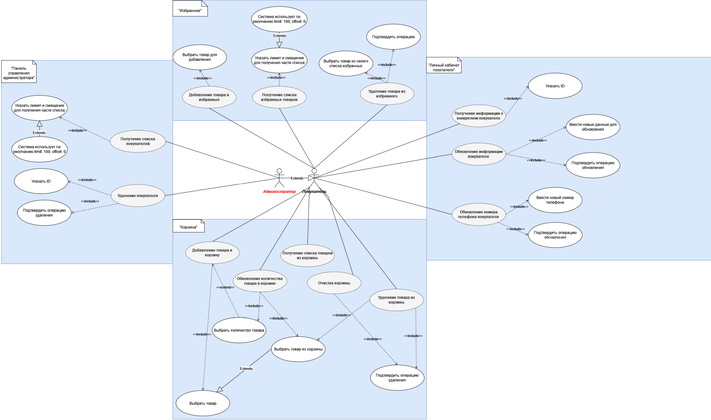

# Диагрмамма прецедентов

# Функции, которые предоставлены

## Личный кабинет

**1. Получение списка покупателей (list_customers)**

| Название функции | **Получение списка покупателей (list_customers)** |
| --- | --- |
| *Описание диаграммы* | Сценарий, в котором администратор системы запрашивает список всех покупателей по определенному критерию |
| *Общие требования* | Администратор должен быть авторизован в системе. |
| *Актеры* | Администратор |
| *Предусловия* | Администратор авторизован в системе. |
| *Основной поток* | 1. Администратор выбирает опцию получения списка покупателей. 2. Администратор указывает лимит и смещение для получения части списка. 3. Система возвращает список покупателей с учетом указанных параметров. |
| *Альтернативные потоки* | Администратор не указывает лимит или смещение, система использует параметры по умолчанию: (limit: 100, offset: 0) |
| *Постусловия* | Администратор получает список покупателей в системе. |

**2. Получение информации о конкретном покупателе (get_customer)**

| Название функции | **Получение информации о конкретном покупателе (get_customer)** |
| --- | --- |
| *Описание диаграммы* | Сценарий, в котором покупатель запрашивает информацию о себе. |
| *Общие требования* | Покупатель должен быть авторизован в системе. |
| *Актеры* | Покупатель |
| *Предусловия* | Покупатель авторизован в системе. |
| *Основной поток* | 1. Покупатель выбирает опцию получения информации о покупателе. 2. Покупатель указывает свой ID. 3. Система возвращает информацию о запрошенном покупателе. |
| *Альтернативные потоки* | Покупатель указывает некорректный ID, система выводит сообщение об ошибке. |
| *Постусловия* | Покупатель получает информацию о себе. |

**3. Удаление покупателя (delete_customer)**

| Название функции | **Удаление покупателя (delete_customer)** |
| --- | --- |
| *Описание диаграммы* | Сценарий, в котором администратор системы удаляет учетную запись определенного покупателя. |
| *Общие требования* | Администратор должен быть авторизован в системе. |
| *Актеры* | Администратор |
| *Предусловия* | Администратор авторизован в системе. |
| *Основной поток* | 1. Администратор выбирает опцию удаления покупателя. 2. Администратор указывает ID покупателя, учетную запись которого нужно удалить. 3. Система выводит всплывающее окно с подтверждением операции (кнопки подтвердить и отменить). 4. Система подтверждает удаление учетной записи покупателя. |
| *Альтернативные потоки* | Администратор указывает некорректный ID, система выводит сообщение об ошибке. |
| *Постусловия* | Учетная запись выбранного покупателя успешно удалена из системы. |

**4. Обновление информации о покупателе (update_customer)**

| Название функции | **Обновление информации о покупателе (update_customer)** |
| --- | --- |
| *Описание диаграммы* | Сценарий, в котором администратор или сам покупатель обновляет данные своего профиля. |
| *Общие требования* | Администратор/покупатель должны быть авторизованы в системе. |
| *Актеры* | Администратор, Покупатель |
| *Предусловия* | Администратор/покупатель авторизованы в системе. |
| *Основной поток* | 1. Администратор/покупатель выбирает опцию обновления информации о покупателе. 2. Администратор/покупатель вводят новые данные для обновления профиля. 3. Система выводит всплывающее окно с подтверждением операции (кнопки подтвердить и отменить). 4. Система проверяет валидность введенных данных. 5. Система обновляет профиль покупателя с предоставленной информацией. |
| *Альтернативные потоки* | Введенные данные не валидны, система выводит сообщение об ошибке. |
| *Постусловия* | Информация о профиле покупателя успешно обновлена. |

**5. Обновление номера телефона покупателя (update_phone)**

| Название функции | **Обновление номера телефона покупателя (update_phone)** |
| --- | --- |
| *Описание диаграммы* | Сценарий, в котором администратор или сам покупатель обновляет номер телефона в своем профиле. |
| *Общие требования* | Администратор/покупатель должны быть авторизованы в системе. |
| *Актеры* | Администратор, Покупатель |
| *Предусловия* | Администратор/покупатель авторизованы в системе. |
| *Основной поток* | 1. Администратор/покупатель выбирает опцию обновления номера телефона. 2. Администратор/покупатель вводят новый номер телефона. 3. Система выводит всплывающее окно с подтверждением операции (кнопки подтвердить и отменить).  4. Система проверяет валидность введенного номера телефона. 5. Система обновляет номер телефона покупателя с предоставленной информацией. |
| *Альтернативные потоки* | Введенный номер телефона не валиден или не подтвержден, система выводит сообщение об ошибке. |
| *Постусловия* | Номер телефона покупателя успешно обновлен. |

## Избранные

**6. Удаление товара из избранных (delete_favorite)**

| Название функции | **Удаление товара из избранных (delete_favorite**) |
| --- | --- |
| *Описание диаграммы* | Сценарий, в котором администратор или покупатель удаляет товар из списка избранных. |
| *Общие требования* | Администратор/покупатель должны быть авторизованы. Система должна иметь доступ к базе данных с товарами. |
| *Актеры* | Администратор, Покупатель |
| *Предусловия* | Администратор/покупатель авторизован в системе и имеет товары в списке избранных. |
| *Основной поток* | 1. Покупатель выбирает товар из своего списка избранных для удаления.  2. Удаление товара посредством повторного клика на иконку сердечка:   Система удаляет товар из избранного и окрашивает сердечко в серый цвет. 3. Система подтверждает удаление товара из списка избранных и окрашивает сердечко в серый цвет. |
| *Альтернативные потоки* | Покупатель отменяет операцию удаления товара на всплывающем окне. Товар не удаляется из избранного. |
| *Постусловия* | Товар успешно удален из списка избранных покупателя. |

**7. Добавление товара в избранные (add_favorite)**

| Название функции | **Добавление товара в избранные (add_favorite)** |
| --- | --- |
| *Описание диаграммы* | Сценарий, в котором администратор или покупатель добавляет товар в свой список избранных. |
| *Общие требования* | Администратор/покупатель должны быть авторизованы. Система должна иметь доступ к базе данных с товарами. |
| *Актеры* | Администратор, Покупатель |
| *Предусловия* | Администратор/покупатель авторизован в системе. |
| *Основной поток* | 1. Покупатель выбирает товар для добавления в избранные посредством клика на иконку сердечка на карточке товара. 2. Система подтверждает добавление товара в список избранных и окрашивает иконку сердечка в красный цвет. |
| *Альтернативные потоки* | Администратор или покупатель отменяет операцию добавления товара в список избранных. |
| *Постусловия* | Товар успешно добавлен в список избранных покупателя. |

**8. Получение списка избранных товаров (list_favorites)**

| Название функции | **Получение списка избранных товаров (list_favorites**) |
| --- | --- |
| *Описание диаграммы* | Сценарий, в котором администратор или покупатель запрашивает список своих избранных товаров с определенным лимитом и смещением. |
| *Общие требования* | Администратор или покупатель должен быть авторизованы. Система должна иметь доступ к базе данных с товарами. |
| *Актеры* | Покупатель |
| *Предусловия* | Покупатель авторизован в системе и имеет товары в списке избранных. |
| *Основной поток* | 1. Покупатель запрашивает список своих избранных товаров с указанием лимита и смещения. 2. Система возвращает список избранных товаров. |
| *Альтернативные потоки* | Покупатель не указывает лимит или смещение, система использует параметры по умолчанию (limit: 100, offset: 0) |
| *Постусловия* | Администратор или покупатель получает список своих избранных товаров. |

## Корзина

**9. Добавление товара в корзину (add_product_to_shopping_cart)**

| Название функции | **Добавление товара в корзину (add_product_to_shopping_cart)** |
| --- | --- |
| *Описание диаграммы* | Сценарий, в котором покупатель или администратор добавляет товар в свою корзину покупок. |
| *Общие требования* | Администратор/покупатель должен быть авторизован. Система должна иметь доступ к базе данных с товарами. |
| *Актеры* | Администратор, Покупатель |
| *Предусловия* | Администратор/покупатель авторизован в системе. |
| *Основной поток* | 1. Покупатель выбирает товар и указывает количество для добавления в корзину.  Система проверяет наличие товара в базе данных. 2. Система добавляет товар в корзину покупок покупателя с указанным количеством. |
| *Альтернативные потоки* | Если товар отсутствует в базе данных, система выводит сообщение об ошибке. Если такого количества товаров нет, система сообщает о необходимости корректировки количества товара. |
| *Постусловия* | Товар успешно добавлен в корзину покупок покупателя. |

**10. Очистка корзины (clear_shopping_cart)**

| Название функции | **Очистка корзины (clear_shopping_cart)** |
| --- | --- |
| *Описание диаграммы* | Сценарий, в котором администратор или покупатель удаляют все товары из своей корзины. |
| *Общие требования* | Администратор/покупатель должен быть авторизован. |
| *Актеры* | Администратор, Покупатель |
| *Предусловия* | Администратор/покупатель авторизован в системе и имеет товары в корзине. |
| *Основной поток* | 1. Покупатель выбирает опцию очистки корзины. 2. Система выводит всплывающее окно с подтверждением операции (кнопки подтвердить и отменить). 3. Система подтверждает удаление всех товаров из корзины. |
| *Альтернативные потоки* | Покупатель отменяет операцию очистки. Корзина остается без изменений. |
| *Постусловия* | Корзина покупок покупателя полностью пуста. |

**11. Получение списка товаров из корзины (get_products_from_shopping_cart)**

| Название функции | **Получение списка товаров из корзины (get_products_from_shopping_cart)** |
| --- | --- |
| *Описание диаграммы* | Сценарий, в котором администратор или покупатель запрашивает список товаров из своей корзины. |
| *Общие требования* | Администратор/покупатель должен быть авторизован. |
| *Актеры* | Администратор, Покупатель |
| *Предусловия* | Администратор/покупатель авторизован в системе и имеет товары в корзине. |
| *Основной поток* | 1. Покупатель запрашивает список товаров из своей корзины. 2. Система возвращает список товаров. |
| *Альтернативные потоки* | Корзина пуста, выводится сообщение о том, что корзина пуста и кнопка "Перейти к покупкам". |
| *Постусловия* | Администратор/покупатель получает список товаров из своей корзины. |

**12. Удаление товара из корзины (delete_product_from_shopping_cart)**

| Название функции | **Удаление товара из корзины (delete_product_from_shopping_cart)** |
| --- | --- |
| *Описание диаграммы* | Сценарий, в котором администратор или покупатель удаляет определенный товар из своей корзины. |
| *Общие требования* | Администратор/покупатель должен быть авторизован. |
| *Актеры* | Администратор, Покупатель |
| *Предусловия* | Администратор/покупатель авторизован в системе и имеет товары в корзине. |
| *Основной поток* | 1. Покупатель выбирает опцию удаления товара из корзины путем нажатия на кноку с крестиком в строчке товара. 2. Система подтверждает удаление выбранного товара. |
| *Альтернативные потоки* | Администратор/покупатель отменяет операцию удаления товара. Товар остается в корзине. |
| *Постусловия* | Выбранный товар успешно удален из корзины покупок. |

**13. Обновление количества товара в корзине (update_product_quantity_in_shopping_cart)**

| Название функции | **Обновление количества товара в корзине (update_product_quantity_in_shopping_cart)** |
| --- | --- |
| *Описание диаграммы* | Сценарий, в котором администратор или покупатель изменяет количество конкретного товара в своей корзине. |
| *Общие требования* | Администратор/покупатель должен быть авторизован. |
| *Актеры* | Администратор, Покупатель |
| *Предусловия* | Администратор/покупатель авторизован в системе и имеет товары в корзине. |
| *Основной поток* | 1. Покупатель выбирает опцию изменения количества товара в корзине.  2. Покупатель указывает новое количество товара. 3. Система обновляет количество выбранного товара в корзине. |
| *Альтернативные потоки* | Администратор/покупатель вводит некорректное количество, система выводит сообщение об ошибке. |
| *Постусловия* | Количество товара в корзине успешно обновлено. |
